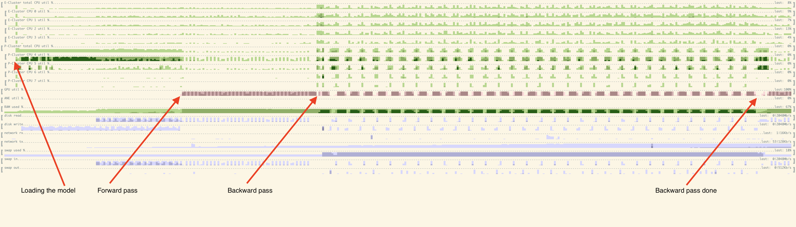
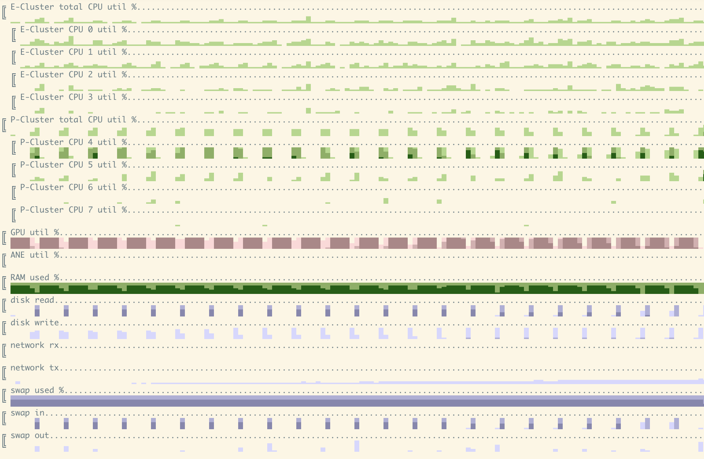

### testing 

Testing requires for now:
1. llama2.c (+ commend out weight-tying there)
2. llama from meta (repo with code)
3. llama2 weights + tokenizer

```
python split_model/test_backprop.py ../llama-2-7b/
python split_model/test_gen.py ../llama-2-7b/

```

### TODO:
```
[x] just path to llama folder, no individual files
[x] make backprop work. Have to use larger device to test, no way to run locally. Actually, it worked but very slow.
[x] backprop: better handling of device, including backprop
[x] integration test
[x] export back to normal llama format.
[x] make dropout work. use get_rng_state to make forward/backward pass match.
[x] tokenizer + generation of something readable
[x] fix 'eval' mode for phantom layers - dropout is not respected.
[?] training: fine-tune on a real dataset
[x] test on cuda
[x] rather than comparing to reference implementation save the output.
[ ] pass learning rate around, not configure in 3 different places.
[ ] use shared memory rather than pipe
[ ] offload embeddings & output linear layer as well.
[ ] improve loading time as it is important for testing
[ ] optimizations - prefetch the phantom, save asyncronously, measure utilization, etc.
[x] get rid of dependency on llama.c on test 
[ ] larger llama2 (15/70)?
[ ] training: test on large fast machine with cuda
```

### performance current status

All of the tests/measurements were done on Apple M1 with 16Gb RAM and 256Gb SSD.

Some measurements first:


Looking at utilization plot at higher resolution (100ms time step) we can see what's going on more clearly:


Running benchmark:
```
Loaded 292 module metadata
Created blank model
processing transformer blocks ................................ DONE
populated all weights to model
loaded phantom model in 90.93994903564453 seconds
forward pass in 69.44901394844055 seconds
backward pass in 192.10568189620972 seconds
forward pass in 78.87712097167969 seconds
backward pass in 201.73040509223938 seconds
```

Specific things we could improve:
* quantization (just float16/bfloat16 or maybe lora)
* prefetch/async save of the next/previous module. This will come at increased RAM usage - need to test.
* to save more memory we can wrap embedding table and output in phantom modules as well. These are largest individual layers.
* Change the way we serialize blocks, don't do full serialization

#### What is taking memory? And how much is it?

For llama2-7b
The model itself:
tok_embeddings.weight - 4096*32000=131072000 items. + gradient * bytes per element. ~1Gb at float32
output.weight - same, 1Gb at float32
For each transformer block we have attention and feedforward items
feedforward - 3 linear nn with 45088768 elements each. 45088768 * 3 * 2 (for grad) = ~270. Same 1Gb at float32
attention - 16777216 elements for each of the 4 linear layers. So total = 16777216 * 4 * 2 (for grad) = 135M. 0.5Gb at float32

For data/activations: TBD


### References
* [llama2.c](https://github.com/karpathy/llama2.c)
* [llama](https://github.com/facebookresearch/llama)
* [cubestat](https://github.com/okuvshynov/cubestat)