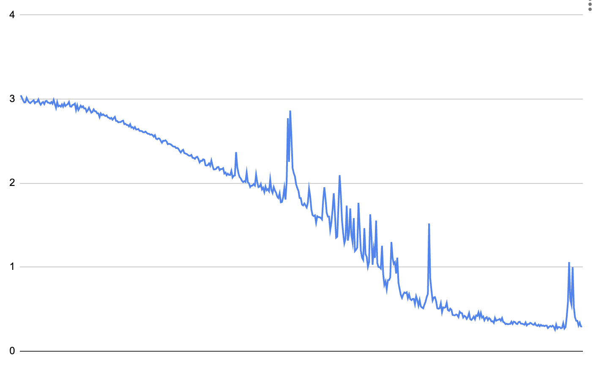
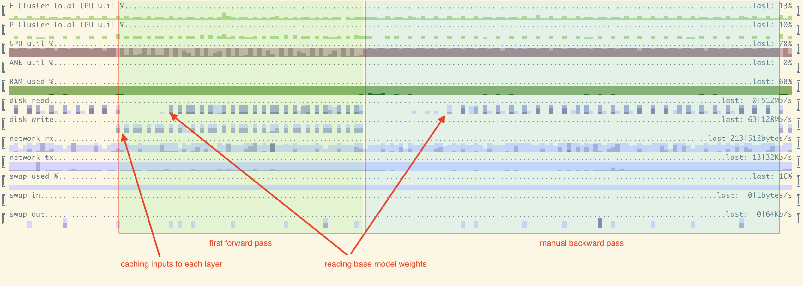

## slowllama

Fine-tune Llama2 models, including 70B on Apple M1/M2 devices.

slowllama is not using any quantization. Instead, it offloads parts of model to SSD on both forward/backward passes. In contrast with training large models from scratch (unattainable) or inference (where we are likely to care about interactivity and tokens/sec), we can still get something finetuned if we allow it to run, say, overnight in batches of modest size.

Current version is using LoRA to limit the updates to a smaller set of parameters. First version supported full finetuning as well, but I decided to remove that for now, more on that below.

slowllama is most definitely not suitable for anything research-like with heavy experimentation as it is too slow - the iteration cycle lnegth would kill the productivity. The use-case here is rather to be part of a product (built and debugged on more powerful HW) which makes small changes based on personal/local data, for example set of documents or code someone is working on.

Finetuning is the only focus here, there's nothing special done for inference, consider [llama.cpp](https://github.com/ggerganov/llama.cpp) for that.

It should work without any change on CUDA, but I didn't do any tests/optimization for that - most likely we'll move things around between storage/RAM/GPU more than we should.

### Example

In order to fine-tune llama2 model we need to:
1. Install dependencies: ```pip install torch sentencepiece``` 
2. Clone [llama2](https://github.com/facebookresearch/llama) and follow its instructions to download the models. It will download tokenizer as well. tokenizer.model should be put into the same directory as llama model itself. Example folder structure could look like:
```
/parent/
    /llama-2-7b/... # <- put tokenizer.model here
    /llama-2-13b/... # <- and here
    /llama-2-70b/... # <- and here as well
    /llama/...     # <-- this is Meta's llama2 repository
    /slowllama/... # <- this repo
```

Let's start with a [tiny example](test_data/cubestat.txt). It is an intro to the description of my other open-source project - [cubestat](https://github.com/okuvshynov/cubestat). It is small enough to just be included as part of the prompt, but it's a decent illustration. As I just published that project recently, there's no way original llama would know anything about it. 

Asking base llama2-7b to complete the prompt "Cubestat reports the following metrics: " gives a continuation "Cubestat reports the following metrics: 1) the number of cubes in the system, 2) the number of cubes that are in the process of being created". 

Try is out:
```
python test_gen.py ../llama-2-7b mps
```

Now let's finetune the 7b model on Mac Mini M1 with 16Gb of unified memory.

```
python finetune.py
```

[finetune.py](finetune.py) is a very simple script which trains LoRA weights based on the plaintext data. There are some settings you could change here, like sequence length, batch size, learning rate, dropout rate, number of iterations. Current settings are pretty much a guess, change this if desired. Model path for input/output is hardcoded in that script as well, change accordingly.

Here's train dataset loss:



I didn't added a validation set for this data and just checked what would we produce for the prompt.

At ~100 iteration we get the following: ```Cubestat reports the following metrics: 1. The number of times the application was launched. 2. The number of times the application was closed.```


At ~400 iteration much better continuation is produced: 

```
Cubestat reports the following metrics: 1.
CPU utilization. 2
GPU utilization. 3
Memory usage. 4
Network interface utilization.
```

### How does it work?
For all versions - 7B, 13B and 70B the process is roughly the same.

First, we need to be able to load a model which takes more RAM than we have. We create model instance with all large modules' weights offloaded to SSD - all of the transformer blocks, token embeddings and output linear layer. After that we load model shards one by one, for each shard iterate over all modules, update corresponding subset of its weights and save it back. 

Original llama2 weights are in bfloat16, but mps backend doesn't support that type natively, so we do computation in float32 instead.

Doing forward path is easy - we just load each module when we need, evaluate it and propagate the result. Backward pass is a little more tricky. The way it's currently implemented is:
1. Do a forward pass the same way as above, while also saving inputs to each block to the hard drive. The goal of the first forward pass is to compute the final loss and cache inputs to each offloaded layer. 
2. Then, do a manual backward gradient propagation. We start from the end, and for each offloaded block re-run it with the cached input again. We run backward pass within that block and pass the gradient for the input to the next (previous?) module. As we use LoRA, only LoRA weights are being updated and we store them in memory. Very important: we also need to save and restore random number generation state. During training we use dropout, and randomly switched off neurons should be the same on both forward passes.
3. After that we run optimizer step on LoRA weights and save them separately if needed.

Original version which can be still found [here](https://github.com/okuvshynov/experiments/tree/5cf944cb1274e577d1e755e6ad1957190d286d9d/split_model) was capable of doing full finetuning and update all weights pretty much the same way. However, I decided to remove that for now. The reason for removal was the very high volume of writes to SSD which can negatively impact SSD life - we can read from SSD as much as we want, but there's a write limit. They are usually high enough that normal usage, but in the case of full finetunining we'll have to write, say, ~150Gb per one iteration/weight update of llama70, assuming stateless optimizer and no gradient accumulation With AdamW we'll have to save/update another 150-300Gb (depending on data types used) of optimizer state per iteration. If, for example, we assume 1Pb of writes, even 100 iterations of finetuning would cost too much. We can bring it back if needed though.

### Resource utilization/requirements/limitations

1. It is slow, but GPU is reasonably well utilized;
2. SSD requirements - even for 13B model you'll need 27Gb for original weights + 27Gb for intermediate weights of free space. Expect hundreds of Gb for 70B model.



Here we can see resource utilization for 1 full iteration - forward and manual backward passes. A few notes:
1. Forward pass has lower GPU utilization and spends more time on IO as we need to both read weights and write cached inputs/outputs
2. Backward pass achieves very high GPU utilization, close to 100%
3. As we move along layers back and forth, we effectively process them in LIFO order. Thus in the beginning of both forward and backward pass we don't have to access disk, weights are being cached and we don't see disk reads.

Each iteration was taking ~2.5 min. 

If it is that slow, what's the point?

1. The use-case is not doing research. The way I thought about it was to finetune something personal based on small amount of new data I have. It would be fine to just let it run overnight but keep everything local and not pass the model/data around.
2. Training settings are most likely suboptimal, we can try optimizer with momentum, different learning rate, batch size, sequence length, etc.
3. There are some further optimizations: prefetch the weights and inputs, save inputs asynchronously
4. The tests here were done on oldest available M1. Modern higher-end laptops with M2 Max should have ~5x GPU performance, and upcoming models might be even more powerful.
5. Computation is done in float32. MPS device doesn't support bfloat16, but supports float16 - we can look at that. 
6. This approach can be used not only for original llama2 by Meta, but for smaller models with similar architecture, for example ones produced by [llama2.c](https://github.com/karpathy/llama2.c). Need to make weight tying for embedding/output configurable though.


### Project structure

Just a few files with no large dependencies other than torch and sentencepiece for tokenizer.
```
blackbox_model.py -- model definition and manual backprop implementation
finetune.py - script which does the training
loader.py - manual loading/saving of large llama2 models (including 70B)
utils.py - small utility functions, including saving/loading random generator state for different devices.
test_gen.py - complete the sequence. Useful for sanity checks.

```

### TODO:
```
[ ] merge lora back with base model weights and export model in original format. Current 'save' would just save a copy of the original model.
[ ] make lora params (rank, alpha, dropout) configurable
[ ] check how it works on CUDA
[ ] optimizations - prefetch the next layer/input, save asyncronously, etc.
[ ] tests, cleanup and comments.
[ ] progress tracking for everything
[ ] quantization
[ ] improve loading time as it is important for testing
[ ] configurable weight tying
[ ] check RNG state correctness
```

### References
* [llama](https://github.com/facebookresearch/llama)
* [llama.cpp](https://github.com/ggerganov/llama.cpp)
* [llama2.c](https://github.com/karpathy/llama2.c)
* [cubestat](https://github.com/okuvshynov/cubestat)
* [LoRA](https://arxiv.org/abs/2106.09685)