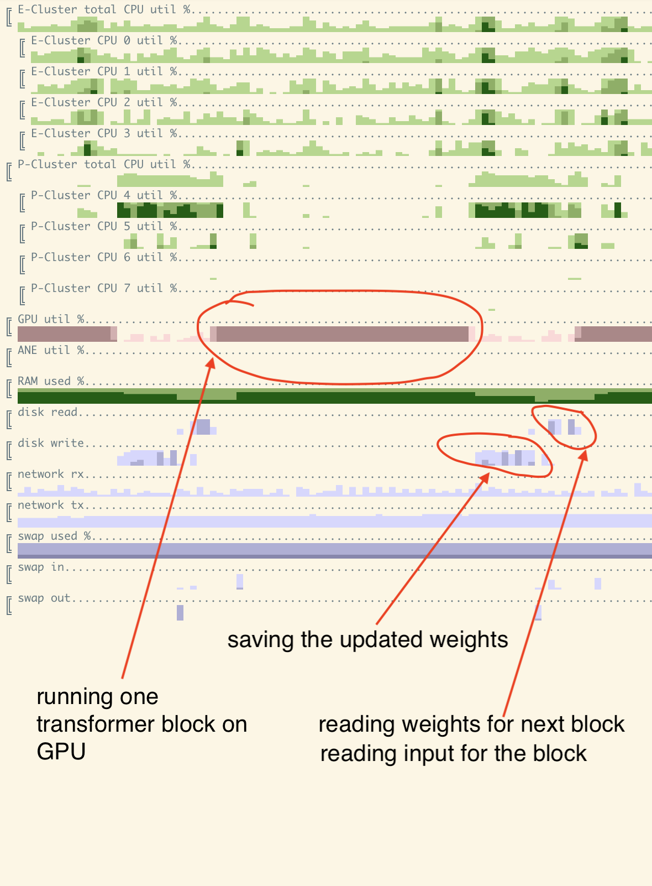

### testing 

Testing requires for now:
1. llama2.c (+ commend out weight-tying there)
2. llama from meta (repo with code)
3. llama2 weights + tokenizer

```
python split_model/test_backprop.py ../llama-2-7b/
python split_model/test_gen.py ../llama-2-7b/

```

### TODO:
```
[x] just path to llama folder, no individual files
[x] make backprop work. Have to use larger device to test, no way to run locally. Actually, it worked but very slow.
[x] backprop: better handling of device, including backprop
[x] integration test
[x] export back to normal llama format.
[x] make dropout work. use get_rng_state to make forward/backward pass match.
[x] tokenizer + generation of something readable
[x] fix 'eval' mode for blackbox layers - dropout is not respected.
[?] training: fine-tune on a real dataset
[x] test on cuda
[x] rather than comparing to reference implementation save the output.
[x] pass learning rate around, not configure in 3 different places.
[x] check what exactly takes how much memory
[x] offload embeddings & output linear layer as well.
[ ] improve loading time as it is important for testing
[ ] finetune + save
[?] use shared memory rather than pipe
    [ ] for cuda need to fix this
[ ] optimizations - prefetch the blackbox, save asyncronously, measure utilization, etc.
[x] get rid of dependency on llama.c on test 
[ ] larger llama2 (15/70)?
[ ] training: test on large fast machine with cuda
[ ] try quantize?
```

### performance current status

All of the tests/measurements were done on Apple M1 with 16Gb RAM and 256Gb SSD.

Looking at utilization plot at higher resolution (100ms time step) we can see what's going on more clearly:



Running benchmark:
```
Loaded 292 module metadata
Created blank model
processing transformer blocks ................................ DONE
populated all weights to model
loaded model in 90.93994903564453 seconds
forward pass in 69.44901394844055 seconds
backward pass in 192.10568189620972 seconds
forward pass in 78.87712097167969 seconds
backward pass in 201.73040509223938 seconds
```

Specific things we could improve:
* quantization (just float16/bfloat16 or maybe lora)
* prefetch/async save of the next/previous module. This will come at increased RAM usage - need to test.
* Change the way we serialize blocks, don't do full serialization
* use shared mem, not pipe for gradients passing

#### What is taking memory? And how much is it?

For llama2-7b
The model itself:
tok_embeddings.weight - 4096*32000=131072000 items. + gradient * bytes per element. ~1Gb at float32
output.weight - same, 1Gb at float32
For each transformer block we have attention and feedforward items
feedforward - 3 linear nn with 45088768 elements each. 45088768 * 3 * 2 (for grad) = ~270. Same 1Gb at float32
attention - 16777216 elements for each of the 4 linear layers. So total = 16777216 * 4 * 2 (for grad) = 135M. 0.5Gb at float32

For data/activations: TBD

Running on OS X with /usr/bin/time -l -h -p  shows 

```
5786107904  maximum resident set size
```

After making output layer also offloadable goes down to 
```
5224169472  maximum resident set size
```

Need to measure second process though.

Much better after:
* offloading embeddings and output linear layer to blackbox as well
* manually calling gc.collect

```
learner peak rss: 1819
main peak rss: 2246
[ OK ] weights before
[ OK ] weights after
[ OK ] emb weights before
[ OK ] emb weights after
[ OK ] out logits
...
          2891956224  maximum resident set size
...
          1755929856  peak memory footprint
```


### notes from testing on A100

Steps to make it work:

* get llama-2-7b weights, follow meta instructions
* update torch: ```pip install torch --upgrade```
* install cubestat for monitoring: ```pip install cubestat```
* get llama repo from meta: https://github.com/facebookresearch/llama/tree/main
* get current repo: https://github.com/okuvshynov/experiments/tree/main
* setup vim: https://github.com/okuvshynov/vimrc
* try running test on CPU first: ```python split_model/test_backprop.py ../llama-2-7b/```

Observations:
* ru_maxrss is not right
* test fails when comparing to saved test data.
* try comparing to reference impl. Get https://github.com/karpathy/llama2.c, run ```python split_model/test_backprop.py ../llama-2-7b/ ref```. Comment out weight-tying: ``` # self.tok_embeddings.weight = self.output.weight``` before that.

Comparing with reference works:
[ OK ] weights before
[ OK ] weights after
[ OK ] emb weights before
[ OK ] emb weights after
[ OK ] out logits

With abundant memory, blackbox is obviously slower: 
loaded model in 155.92071843147278 seconds
forward pass in 12.745762348175049 seconds
backward pass in 50.55747389793396 seconds

vs 

loaded plain model in 107.6094651222229 seconds
plain forward pass in 1.8743972778320312 seconds
plain backward pass in 4.215214490890503 seconds

Let's try generation:
```python split_model/test_gen.py ../llama-2-7b/```

Needs sentencepiece for tokenizer, so ```pip install sentencepiece```

Running again:
```
python split_model/test_gen.py ../llama-2-7b/

...
next token: tensor([[304]]) ['to']
next token: tensor([[367]]) ['be']
next token: tensor([[9796]]) ['happy']
next token: tensor([[29889]]) ['.']
```

Works. Let's try on CUDA:
```
python split_model/test_gen.py ../llama-2-7b/ cuda
...
next token: tensor([[304]], device='cuda:0') ['to']
next token: tensor([[367]], device='cuda:0') ['be']
next token: tensor([[9796]], device='cuda:0') ['happy']
next token: tensor([[29889]], device='cuda:0') ['.']
```

GPU util was low during this, both compute (~10%) and memory usage (~6%).

Let's try benchmarking backprop:

```
python split_model/benchmark_backprop.py ../llama-2-7b
```

Had to modify device in the file, need to make configurable.

After this is done, we can check how large can we make batch size/seq_len until we run out of memory.
12% GPU memory use with batch size = 2 and small seq len (100?). 
Let's try larger seq_len, like 2048. 

Increase batch to 4.

What we need to compare it to though - backprop on larger sequence lengths/batch sizes on reference implementations.

With batch_size = 4 and seq_len = 2048 we are at 58% GPU memory util (out of 40Gb). 

Reference impl CUDA OOMs at batch 4.

Don't care about quantization as long as we are consistent in what we use.

### dependencies
* pip install torch
* pip install sentencepiece # for tokenizer

### References
* [llama2.c](https://github.com/karpathy/llama2.c)
* [llama](https://github.com/facebookresearch/llama)
* [cubestat](https://github.com/okuvshynov/cubestat)
